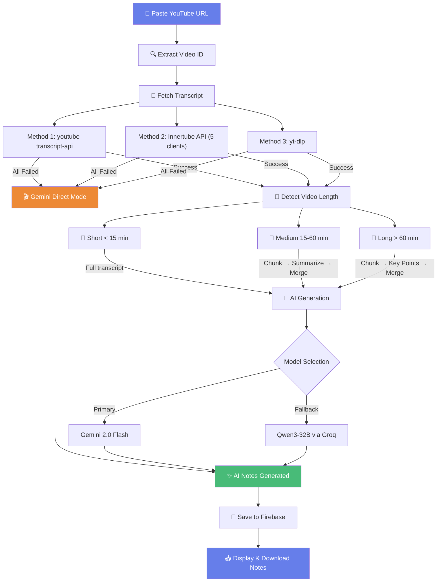

# 🎬 YouTube Transcripter

> **AI-Powered Notes Generator** — Paste any YouTube URL and get detailed, structured study notes instantly. Handles videos of any length.


---

## ✨ Features

- 🔐 **Secure Auth** — Signup/Login with JWT + Google OAuth
- 🤖 **Dual AI** — Google Gemini 2.0 Flash (primary) + Qwen3 via Groq (fallback)
- 📏 **Any Video Length** — Smart chunking for short clips to 3-hour lectures
- 🌍 **Multilingual** — Generate notes in any language
- 👥 **Role-Based** — Tailored notes for Child, Student, Teacher, or Professional
- 📥 **Download** — Copy or download notes as Markdown
- 📜 **History** — All notes saved per user in Firebase
- 🎨 **Premium UI** — Dark glassmorphism theme with animated panda login

---

## � How It Works



---

## �🚀 Quick Start

```bash
# Clone
git clone https://github.com/DineshDk431/YouTube_Transcript_Api.git
cd YouTube_Transcript_Api

# Install
pip install -r requirements.txt

# Configure .env
GEMINI_API_KEY=your-key
GROQ_API_KEY=your-key
SECRET_KEY=your-secret
FIREBASE_CREDENTIALS=serviceAccountKey.json
GOOGLE_CLIENT_ID=your-client-id

# Run
python main.py
# Open http://localhost:8000
```

---

## 🏗️ Tech Stack

| Layer | Technology |
|-------|-----------|
| Backend | FastAPI + Uvicorn |
| AI Models | Google Gemini 2.0 Flash, Qwen3-32B (Groq) |
| Database | Firebase Firestore |
| Auth | JWT + Google OAuth |
| Frontend | Vanilla HTML/CSS/JS |
| Deployment | Render (free tier) |

---

## 🚀 Deploy on Render

Set these environment variables on Render:

| Variable | Description |
|----------|-------------|
| `GEMINI_API_KEY` | Google Gemini API key |
| `GROQ_API_KEY` | Groq Cloud API key |
| `SECRET_KEY` | JWT signing secret |
| `FIREBASE_CREDENTIALS` | `serviceAccountKey.json` |
| `GOOGLE_CLIENT_ID` | Google OAuth client ID |

---

## 📝 License

MIT License

<p align="center"><b>Built with ❤️ by Dinesh</b></p>
